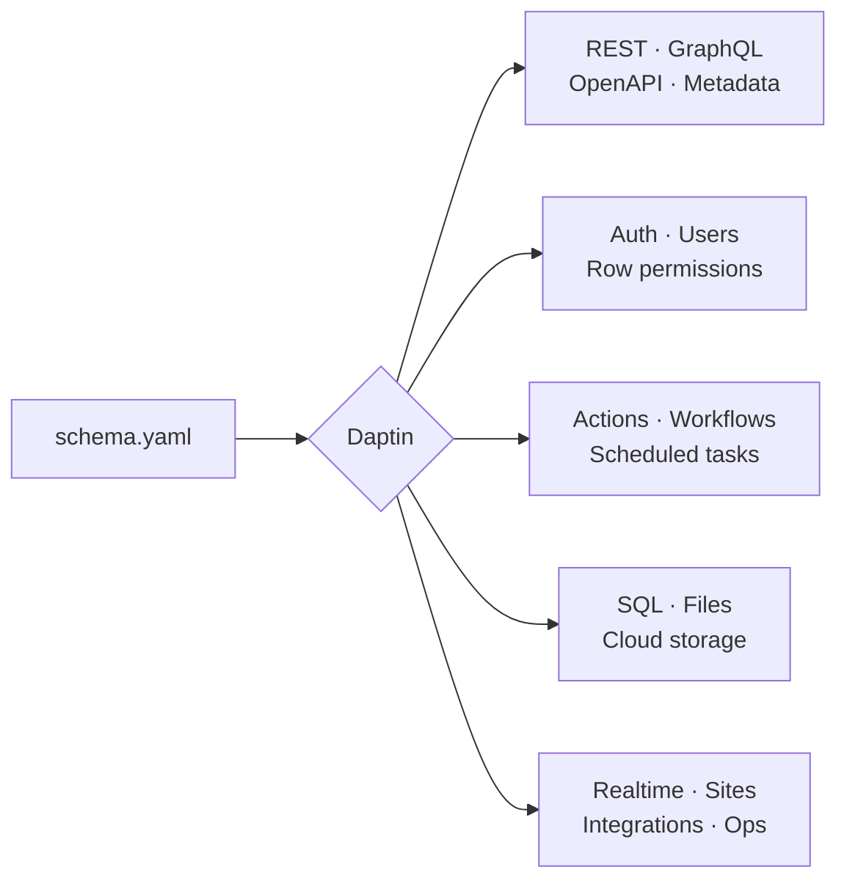
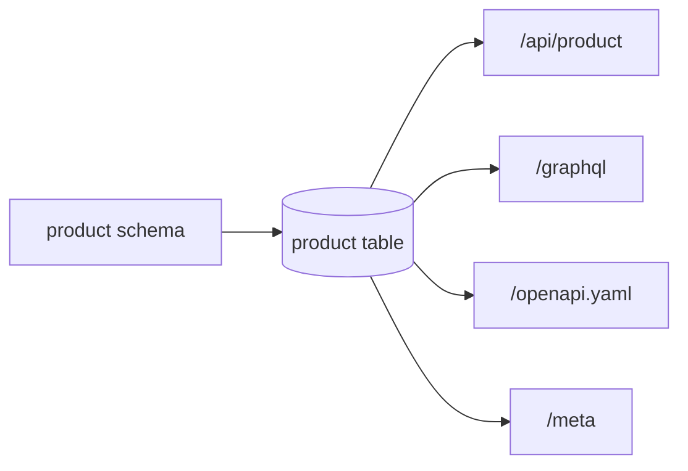
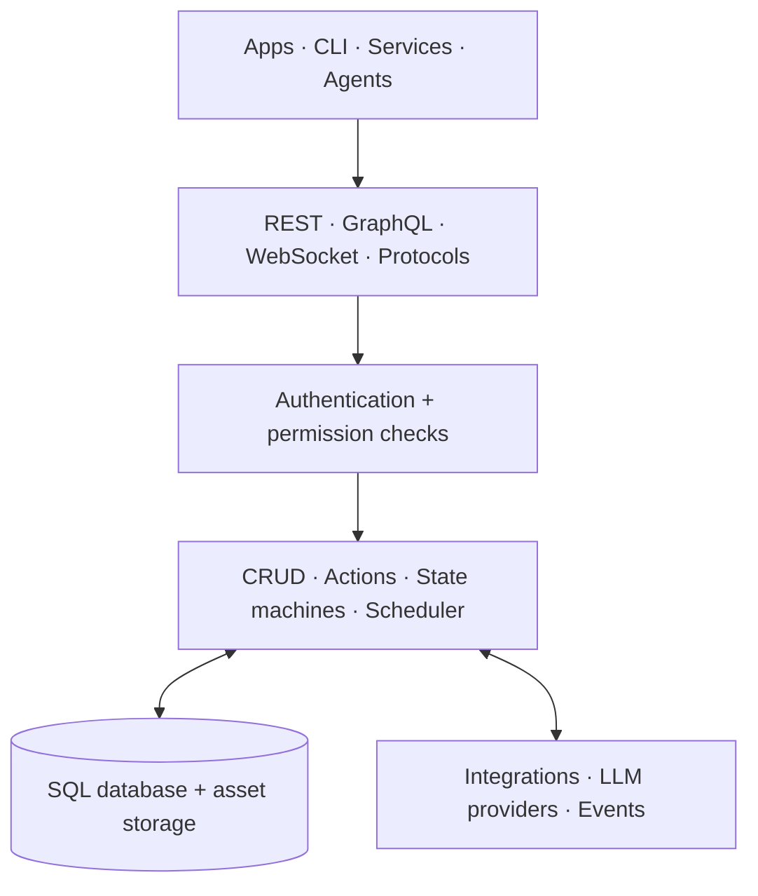

<div align="center">
  
  <h1>Daptin</h1>
  <p><strong>Turn a data model into a production-ready backend.</strong></p>
  <p>APIs, auth, permissions, files, workflows, integrations, realtime, and operations—one server.</p>

  <p>
    <a href="https://github.com/daptin/daptin/releases/latest"></a>
    <a href="LICENSE"></a>
    <a href="https://goreportcard.com/report/github.com/daptin/daptin"></a>
    <a href="https://discord.gg/t564q8SQVk"></a>
  </p>
  <p>
    <a href="#run-it">Get started</a> · <a href="#how-it-works">How it works</a> · <a href="https://github.com/daptin/daptin/wiki">Documentation</a> · <a href="https://github.com/daptin/daptin-schema-samples">Examples</a>
  </p>
</div>

---

## From schema to backend



Use Daptin as the backend for a new product, or place it beside an existing stack to add the pieces you need.

| Define | Daptin generates | You ship |
| :---: | :---: | :---: |
| Tables & relations | CRUD APIs & validation | Web and mobile apps |
| Users & groups | Auth & row-level policy | SaaS and internal tools |
| Actions & states | Workflows & scheduled jobs | API and AI products |
| Assets & stores | Uploads & hosted sites | Portals and content sites |

## What is inside?

| | Capability | Highlights |
|---|---|---|
| 🧱 | **Data + APIs** | SQLite, PostgreSQL, MySQL/MariaDB · JSON:API · GraphQL · OpenAPI · import/export |
| 🔐 | **Identity + policy** | JWT sessions · OAuth client/provider · users, groups, tenants · entity and row permissions |
| ⚙️ | **Backend logic** | Actions · state machines · scheduled tasks · validation · data exchange |
| 🗂️ | **Files + sites** | Asset columns · local/cloud storage · uploads · static sites · caching |
| ⚡ | **Realtime + protocols** | WebSockets · YJS · feeds · SMTP/IMAP · FTP · CalDAV/CardDAV |
| 🔌 | **Integrations + AI** | OpenAPI integrations · encrypted credentials · OpenAI-compatible LLM routing |
| 📊 | **Product + operations** | Metering · quotas · rate limits · audit · TLS · health · monitoring |

> **One policy boundary:** APIs, actions, files, integrations, and events all use the same users, groups, ownership, and permission model.

## Run it

### Binary

```bash
curl -L -o daptin https://github.com/daptin/daptin/releases/latest/download/daptin-linux-amd64
chmod +x daptin
./daptin -port=6336
```

### Docker

```bash
docker run --rm -p 6336:8080 -p 6443:6443 daptin/daptin:v0.12.31
```

Open **http://localhost:6336**, create the first admin user, and follow the [Getting Started Guide](https://github.com/daptin/daptin/wiki/Getting-Started-Guide).

## Build your first API

Create `schema_product.yaml` beside the Daptin binary:

```yaml
Tables:
  - TableName: product
    Columns:
      - Name: name
        DataType: varchar(200)
        ColumnType: label
        IsIndexed: true
      - Name: price
        DataType: float
        ColumnType: measurement
      - Name: published
        DataType: bool
        ColumnType: truefalse
        DefaultValue: "false"
```

Restart Daptin. The model is now available through several generated surfaces:



```http
GET    /api/product
POST   /api/product
PATCH  /api/product/{reference_id}
DELETE /api/product/{reference_id}
```

Next, add [relations](https://github.com/daptin/daptin/wiki/Relationships), [permissions](https://github.com/daptin/daptin/wiki/Permissions), [actions](https://github.com/daptin/daptin/wiki/Actions-Overview), or [file storage](https://github.com/daptin/daptin/wiki/Cloud-Storage).

## How it works



Every row gets a public `reference_id`, version, timestamps, and permissions. Daptin applies validation and policy before work reaches storage, actions, or external integrations.

## See it

| Admin dashboard | Visual data modeling |
| :---: | :---: |
| [](docs/images/dashboard/index-page.png) | [](docs/images/dashboard/create-new-table.png) |
| **Generated OpenAPI** | **GraphQL explorer** |
| [](docs/images/dashboard/openapi-spec-page.png) | [](docs/images/dashboard/graphql-web-interface.png) |

## Choose your path

| I want to… | Start here |
|---|---|
| Install and configure Daptin | [Installation](https://github.com/daptin/daptin/wiki/Installation) · [First admin setup](https://github.com/daptin/daptin/wiki/First-Admin-Setup) |
| Model data and expose APIs | [Core concepts](https://github.com/daptin/daptin/wiki/Core-Concepts) · [API reference](https://github.com/daptin/daptin/wiki/API-Reference) |
| Secure users, rows, and actions | [Permissions](https://github.com/daptin/daptin/wiki/Permissions) · [OAuth](https://github.com/daptin/daptin/wiki/OAuth-Authentication) |
| Automate backend behavior | [Actions](https://github.com/daptin/daptin/wiki/Actions-Overview) · [State machines](https://github.com/daptin/daptin/wiki/State-Machines) |
| Connect services or LLMs | [Integrations](https://github.com/daptin/daptin/wiki/Integrations) · [LLM providers](https://github.com/daptin/daptin/wiki/LLM-Providers) |
| Deploy to production | [Production deployment](https://github.com/daptin/daptin/wiki/Production-Deployment) · [Database setup](https://github.com/daptin/daptin/wiki/Database-Setup) |

<details>
<summary><strong>Production checklist</strong></summary>

- Use PostgreSQL or MySQL/MariaDB instead of development SQLite.
- Set stable `jwt.secret` and `encryption.secret` values.
- Configure HTTPS/TLS, hostnames, backups, restore tests, and durable file storage.
- Enable only the protocols your app needs.
- Configure rate limits, metering, monitoring, and audit behavior.

</details>

## Ecosystem

| Project | Use it for |
|---|---|
| [Daptin CLI](https://github.com/daptin/daptin-cli) | Manage CRUD, actions, OAuth, integrations, storage, and assets |
| [JavaScript client](https://github.com/daptin/daptin-js-client) · [Go client](https://github.com/daptin/daptin-go-client) | Connect applications to Daptin |
| [Schema samples](https://github.com/daptin/daptin-schema-samples) | Start from blogs, stores, task lists, FAQs, payments, and more |
| [LLM demo](https://github.com/daptin/daptin-llm-demo) · [Metering demo](https://github.com/daptin/daptin-metering-credit-demo) | Build metered AI and API products |
| [Integration auth demo](https://github.com/daptin/daptin-integration-auth-demo) · [OAuth provider demo](https://github.com/daptin/daptin-oauth-provider-demo) | Explore secure external integrations and identity |
| [Dadadash](https://github.com/daptin/dadadash) | See a larger app built on Daptin |

---

<div align="center">
  <strong><a href="https://github.com/daptin/daptin/wiki">Read the docs</a></strong>
  · <a href="https://discord.gg/t564q8SQVk">Discord</a>
  · <a href="https://github.com/daptin/daptin/issues">Issues</a>
  · <a href="https://github.com/daptin/daptin/releases">Releases</a>
  <br><br>
  LGPL v3 · Build your app. Let Daptin run the backend.
</div>
