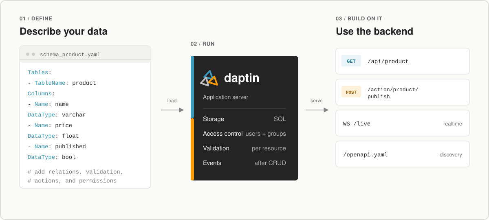
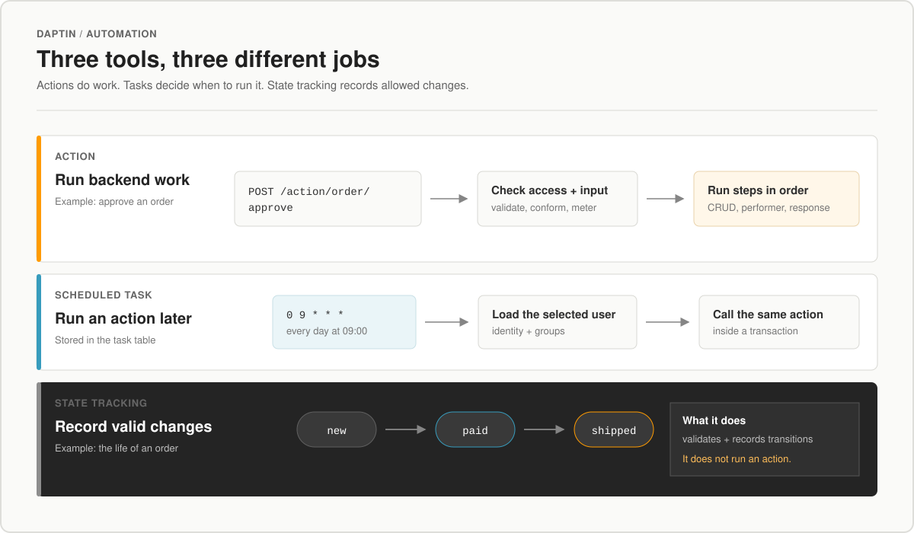

<div align="center">
  
  <h1>Daptin</h1>
  <p><strong>The application server that builds a complete backend around your data.</strong></p>
  <p>Model your business once. Get APIs, authentication, permissions, files, automation, integrations, and operations in one deployable server.</p>

  <p>
    <a href="https://github.com/daptin/daptin/releases/latest"></a>
    <a href="LICENSE"></a>
    <a href="https://goreportcard.com/report/github.com/daptin/daptin"></a>
    <a href="https://discord.gg/t564q8SQVk"></a>
  </p>
  <p>
    <a href="#start-in-a-minute">Quickstart</a> · <a href="#how-automation-works">How it works</a> · <a href="https://github.com/daptin/daptin/wiki">Documentation</a> · <a href="https://github.com/daptin/daptin-schema-samples">Example schemas</a>
  </p>
</div>

<br>

[](docs/images/daptin-overview.svg)

## One server instead of a backend patchwork

| Build with Daptin | What that means for your product |
|---|---|
| **Model data** | Tables, relations, validation, imports, exports, and generated test data |
| **Control access** | Login, users, teams, ownership, and permissions down to each row |
| **Automate work** | Reusable actions, scheduled tasks, state tracking, and background jobs |
| **Handle files** | Uploads, asset fields, cloud storage, caching, and hosted static sites |
| **Connect everything** | REST, GraphQL, OpenAPI, WebSockets, external APIs, OAuth, and LLM providers |
| **Operate the product** | Metering, quotas, rate limits, audit history, TLS, health, and monitoring |

Use it as the primary backend for a new product, or place it beside an existing system to add only the capabilities you need.

## Start in a minute

### Docker

```bash
docker run --rm -p 6336:8080 -p 6443:6443 daptin/daptin:v0.12.31
```

### Linux binary

```bash
curl -L -o daptin https://github.com/daptin/daptin/releases/latest/download/daptin-linux-amd64
chmod +x daptin
./daptin -port=6336
```

Open **http://localhost:6336**, create the first administrator, and you have a working backend. Continue with the [Getting Started Guide](https://github.com/daptin/daptin/wiki/Getting-Started-Guide).

## A small model becomes a usable API

Place `schema_product.yaml` beside the Daptin binary:

```yaml
Tables:
  - TableName: product
    Columns:
      - Name: name
        DataType: varchar(200)
        ColumnType: label
        IsIndexed: true
      - Name: price
        DataType: float
        ColumnType: measurement
      - Name: published
        DataType: bool
        ColumnType: truefalse
        DefaultValue: "false"
```

Start Daptin. It creates the storage, validates incoming data, applies permissions, and exposes the model:

```http
GET    /api/product
POST   /api/product
PATCH  /api/product/{reference_id}
DELETE /api/product/{reference_id}
```

The same model also appears in GraphQL, OpenAPI, metadata, and the administration interface. Add [relations](https://github.com/daptin/daptin/wiki/Relationships), [permissions](https://github.com/daptin/daptin/wiki/Permissions), [actions](https://github.com/daptin/daptin/wiki/Actions-Overview), or [file storage](https://github.com/daptin/daptin/wiki/Cloud-Storage) when the product needs them.

## How automation works

[](docs/images/daptin-automation.svg)

| Term | Plain-English meaning | Example |
|---|---|---|
| **Action** | A named task that runs when asked | Approve an order, generate an invoice, or send a receipt |
| **Schedule** | A timer that starts an action | Send overdue reminders every morning |
| **State machine** | The allowed stages and moves for a record | An order can move from `new` to `paid`, but not directly to `shipped` |
| **Integration** | A protected connection to another service | Take a payment, send email, create an issue, or call an AI model |

Actions do the work. Buttons, API requests, and schedules decide when that work begins. State machines track and restrict stage changes separately.

## Built for more than content

Daptin can power:

- SaaS products with teams, tenants, quotas, and row-level access.
- Internal tools with generated APIs, admin screens, files, and workflows.
- Content sites and portals with structured data, assets, feeds, and hosted frontends.
- API products with plans, usage metering, rate limits, and audit history.
- AI products with OpenAI-compatible endpoints, provider routing, credentials, and usage controls.
- Existing stacks that need authentication, storage, integrations, automation, or realtime events.

<details>
<summary><strong>Explore the complete platform</strong></summary>

### Data and APIs

- SQLite, PostgreSQL, and MySQL/MariaDB.
- JSON:API CRUD, GraphQL, OpenAPI, and live metadata.
- Relations, composite keys, validation, filtering, pagination, aggregation, import, and export.

### Identity and permissions

- Signup, signin, password reset, JWT sessions, OTP/2FA flows, users, and usergroups.
- Entity-level and row-level access for guests, owners, and groups.
- OAuth client connections and OAuth/OIDC-style provider endpoints.

### Automation and integrations

- Actions with inputs, validation, conditions, outcomes, and permissions.
- Scheduled actions, state machines, data exchange, and background processing.
- OpenAPI-backed integrations with OAuth tokens or encrypted credentials.

### Files, sites, and realtime

- Local and cloud storage through rclone-backed providers.
- File and media fields, direct asset serving, cache headers, ETags, and gzip.
- Static site hosting, WebSocket change events, streams, feeds, and optional YJS collaboration.

### Product and operations

- OpenAI-compatible chat, completion, embedding, and model endpoints.
- Plans, quotas, credits, usage logs, and clustered rate limits.
- Audit tables, caching, TLS certificates, health, statistics, and monitoring.

</details>

## Choose your path

| I want to… | Start here |
|---|---|
| Install and configure Daptin | [Installation](https://github.com/daptin/daptin/wiki/Installation) · [First admin setup](https://github.com/daptin/daptin/wiki/First-Admin-Setup) |
| Model data and expose APIs | [Core concepts](https://github.com/daptin/daptin/wiki/Core-Concepts) · [API reference](https://github.com/daptin/daptin/wiki/API-Reference) |
| Secure users, rows, and actions | [Permissions](https://github.com/daptin/daptin/wiki/Permissions) · [OAuth](https://github.com/daptin/daptin/wiki/OAuth-Authentication) |
| Automate backend behavior | [Actions](https://github.com/daptin/daptin/wiki/Actions-Overview) · [State machines](https://github.com/daptin/daptin/wiki/State-Machines) |
| Connect services or LLMs | [Integrations](https://github.com/daptin/daptin/wiki/Integrations) · [LLM providers](https://github.com/daptin/daptin/wiki/LLM-Providers) |
| Deploy to production | [Production deployment](https://github.com/daptin/daptin/wiki/Production-Deployment) · [Database setup](https://github.com/daptin/daptin/wiki/Database-Setup) |

<details>
<summary><strong>Production checklist</strong></summary>

- Use PostgreSQL or MySQL/MariaDB instead of development SQLite.
- Set stable `jwt.secret` and `encryption.secret` values.
- Configure HTTPS/TLS, hostnames, backups, restore tests, and durable file storage.
- Enable only the protocols your product needs.
- Configure rate limits, metering, monitoring, and audit behavior.

</details>

## Ecosystem

| Project | Purpose |
|---|---|
| [Daptin CLI](https://github.com/daptin/daptin-cli) | Manage data, actions, OAuth, integrations, storage, and assets |
| [JavaScript client](https://github.com/daptin/daptin-js-client) · [Go client](https://github.com/daptin/daptin-go-client) | Connect applications to Daptin |
| [Schema samples](https://github.com/daptin/daptin-schema-samples) | Start from blogs, stores, task lists, FAQs, payments, and more |
| [LLM demo](https://github.com/daptin/daptin-llm-demo) · [Metering demo](https://github.com/daptin/daptin-metering-credit-demo) | Explore metered AI and API products |
| [Integration auth demo](https://github.com/daptin/daptin-integration-auth-demo) · [OAuth provider demo](https://github.com/daptin/daptin-oauth-provider-demo) | Explore secure integrations and identity |
| [Dadadash](https://github.com/daptin/dadadash) | See a larger application built on Daptin |

---

<div align="center">
  <strong><a href="https://github.com/daptin/daptin/wiki">Documentation</a></strong>
  · <a href="https://discord.gg/t564q8SQVk">Discord</a>
  · <a href="https://github.com/daptin/daptin/issues">Issues</a>
  · <a href="https://github.com/daptin/daptin/releases">Releases</a>
  <br><br>
  LGPL v3 · Build the product. Let Daptin run the backend.
</div>
