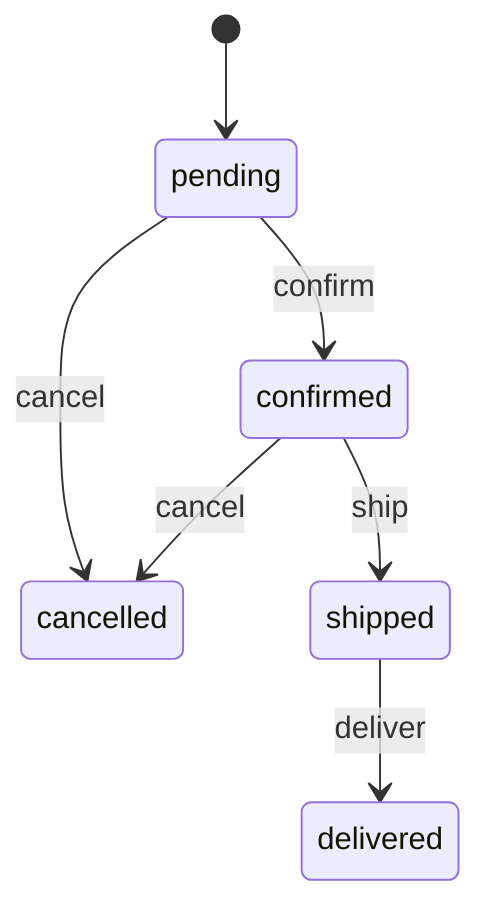

# State Machines

Finite State Machines (FSM) for workflow automation using the `smd` table.

## Overview

Daptin provides a state machine system that:
- ✅ Defines valid states for records
- ✅ Auto-creates `{tablename}_state` tables when `IsStateTrackingEnabled: true`
- ✅ Stores state machine definitions in `smd` table
- ✅ `/track/event/` endpoint - Apply state transitions (~2ms response time)
- ⚠️ `/track/start/` endpoint - Requires proper permissions on `smd` table
- ✅ Uses the [looplab/fsm](https://github.com/looplab/fsm) Go library

**Last Tested:** 2026-01-26 | **Status:** ✅ Fully functional

## Architecture

State machines in Daptin work through:
1. **`smd` table** - Stores state machine definitions
2. **`{tablename}_state` table** - Auto-created to track state instances
3. **HTTP endpoints** - Start state machines and apply transitions

## The `smd` Table

State machine definitions are stored in the `smd` table:

| Column | Type | Description |
|--------|------|-------------|
| `name` | varchar(100) | Unique identifier for the state machine |
| `label` | varchar(100) | Human-readable name |
| `initial_state` | varchar(100) | Starting state for new instances |
| `events` | text (JSON) | Array of transition definitions |

### Events JSON Format

```json
[
  {
    "name": "approve",
    "label": "Approve",
    "color": "#28a745",
    "src": ["pending"],
    "dst": "approved"
  },
  {
    "name": "reject",
    "label": "Reject",
    "color": "#dc3545",
    "src": ["pending"],
    "dst": "rejected"
  },
  {
    "name": "reopen",
    "label": "Reopen",
    "color": "#ffc107",
    "src": ["rejected", "approved"],
    "dst": "pending"
  }
]
```

| Field | Description |
|-------|-------------|
| `name` | Event identifier used in API calls |
| `label` | Display name for UI |
| `color` | Hex color for UI rendering |
| `src` | Array of valid source states |
| `dst` | Destination state after transition |

## Defining State Machines

### Via YAML Schema

```yaml
StateMachineDescriptions:
  - Name: order_workflow
    Label: Order Workflow
    InitialState: pending
    Events:
      - Name: confirm
        Label: Confirm Order
        Src:
          - pending
        Dst: confirmed

      - Name: ship
        Label: Ship Order
        Src:
          - confirmed
        Dst: shipped

      - Name: deliver
        Label: Mark Delivered
        Src:
          - shipped
        Dst: delivered

      - Name: cancel
        Label: Cancel Order
        Src:
          - pending
          - confirmed
        Dst: cancelled
```

### Via API

```bash
# Create state machine definition
curl -X POST http://localhost:6336/api/smd \
  -H "Authorization: Bearer $TOKEN" \
  -H "Content-Type: application/vnd.api+json" \
  -d '{
    "data": {
      "type": "smd",
      "attributes": {
        "name": "ticket_status",
        "label": "Ticket Status",
        "initial_state": "open",
        "events": "[{\"name\":\"assign\",\"label\":\"Assign\",\"src\":[\"open\"],\"dst\":\"assigned\"},{\"name\":\"resolve\",\"label\":\"Resolve\",\"src\":[\"assigned\"],\"dst\":\"resolved\"},{\"name\":\"close\",\"label\":\"Close\",\"src\":[\"resolved\"],\"dst\":\"closed\"}]"
      }
    }
  }'
```

## Enabling State Tracking

To track state for a table, enable state tracking in the table definition:

```yaml
Tables:
  - TableName: order
    IsStateTrackingEnabled: true
    Columns:
      - Name: customer_name
        DataType: varchar(200)
        ColumnType: label
      - Name: total
        DataType: decimal
        ColumnType: measurement
```

When `IsStateTrackingEnabled: true`, Daptin automatically creates:
- `{tablename}_state` table with:
  - `current_state` column
  - Foreign key `is_state_of_{tablename}` to the original table
  - Foreign key `{tablename}_smd` to the state machine definition
  - User tracking columns

## Working with State Machines

### Step 1: List Available State Machines

```bash
curl http://localhost:6336/api/smd \
  -H "Authorization: Bearer $TOKEN"
```

Response:
```json
{
  "data": [
    {
      "type": "smd",
      "id": "abc123",
      "attributes": {
        "name": "order_workflow",
        "label": "Order Workflow",
        "initial_state": "pending",
        "events": "[{\"name\":\"confirm\",...}]"
      }
    }
  ]
}
```

### Step 2: Start a State Machine Instance

Create a state tracking instance for a record.

First, get your state machine definition ID:

```bash
SMD_ID=$(curl -s http://localhost:6336/api/smd \
  -H "Authorization: Bearer $TOKEN" | jq -r '.data[0].id')
```

Then start the state machine for a record:

```bash
# POST /track/start/:stateMachineId
curl -X POST "http://localhost:6336/track/start/$SMD_ID" \
  -H "Authorization: Bearer $TOKEN" \
  -H "Content-Type: application/json" \
  -d '{
    "typeName": "order",
    "referenceId": "019bf89f-71bd-7320-8924-84557fe06fb9"
  }'
```

Response: HTTP 201 Created

This creates a record in `order_state` with:
- `current_state` = `pending` (from initial_state)
- `is_state_of_order` = reference to the order
- `order_smd` = reference to the state machine

### Step 3: Apply a Transition

Get the state instance ID from the state table:

```bash
STATE_ID=$(curl -s http://localhost:6336/api/order_state \
  -H "Authorization: Bearer $TOKEN" | jq -r '.data[0].attributes.reference_id')
```

Apply a transition:

```bash
# POST /track/event/:typename/:objectStateId/:eventName
# Note: Use the BASE table name (order), not the state table (order_state)
curl -X POST "http://localhost:6336/track/event/order/$STATE_ID/confirm" \
  -H "Authorization: Bearer $TOKEN" \
  -H "Content-Type: application/json" \
  -d '{}'
```

**Important:** Use the **base table name** (`order`), NOT the state table name (`order_state`). The server automatically appends `_state` internally.

Response: HTTP 200 OK

The `current_state` field in the `order_state` record is updated to `"confirmed"`.

### Step 4: Query Current State

```bash
curl "http://localhost:6336/api/order_state/$STATE_ID" \
  -H "Authorization: Bearer $TOKEN"
```

## Transition Validation

Transitions are validated by the FSM engine:

1. Load current state from `{typename}_state.current_state`
2. Check if event is valid from current state using `Can(eventName)`
3. If valid, transition to destination state
4. If invalid, return error

### Invalid Transition Error

```json
{
  "errors": [
    {
      "status": "400",
      "title": "Invalid Transition",
      "detail": "event 'ship' inappropriate in current state 'pending'"
    }
  ]
}
```

## Complete Example: Order Workflow

### 1. Create the State Machine

```bash
curl -X POST http://localhost:6336/api/smd \
  -H "Authorization: Bearer $TOKEN" \
  -H "Content-Type: application/vnd.api+json" \
  -d '{
    "data": {
      "type": "smd",
      "attributes": {
        "name": "order_workflow",
        "label": "Order Workflow",
        "initial_state": "pending",
        "events": "[{\"name\":\"confirm\",\"label\":\"Confirm\",\"src\":[\"pending\"],\"dst\":\"confirmed\"},{\"name\":\"ship\",\"label\":\"Ship\",\"src\":[\"confirmed\"],\"dst\":\"shipped\"},{\"name\":\"deliver\",\"label\":\"Deliver\",\"src\":[\"shipped\"],\"dst\":\"delivered\"},{\"name\":\"cancel\",\"label\":\"Cancel\",\"src\":[\"pending\",\"confirmed\"],\"dst\":\"cancelled\"}]"
      }
    }
  }'
```

### 2. Create an Order

```bash
curl -X POST http://localhost:6336/api/order \
  -H "Authorization: Bearer $TOKEN" \
  -H "Content-Type: application/vnd.api+json" \
  -d '{
    "data": {
      "type": "order",
      "attributes": {
        "customer_name": "John Doe",
        "total": 99.99
      }
    }
  }'
# Save the returned reference_id as ORDER_ID
```

### 3. Start State Tracking

```bash
# Get the SMD ID
SMD_ID=$(curl -s http://localhost:6336/api/smd \
  -H "Authorization: Bearer $TOKEN" | \
  jq -r '.data[] | select(.attributes.name == "order_workflow") | .id')

# Start state machine for the order
curl -X POST "http://localhost:6336/track/start/$SMD_ID" \
  -H "Authorization: Bearer $TOKEN" \
  -H "Content-Type: application/json" \
  -d "{\"typeName\":\"order\",\"referenceId\":\"$ORDER_ID\"}"

# Get the state instance ID
STATE_ID=$(curl -s http://localhost:6336/api/order_state \
  -H "Authorization: Bearer $TOKEN" | jq -r '.data[0].attributes.reference_id')
```

### 4. Transition Through States

```bash
# Confirm the order (use base table name: order)
curl -X POST "http://localhost:6336/track/event/order/$STATE_ID/confirm" \
  -H "Authorization: Bearer $TOKEN" \
  -H "Content-Type: application/json" \
  -d '{}'

# Ship the order
curl -X POST "http://localhost:6336/track/event/order/$STATE_ID/ship" \
  -H "Authorization: Bearer $TOKEN" \
  -H "Content-Type: application/json" \
  -d '{}'

# Mark delivered
curl -X POST "http://localhost:6336/track/event/order/$STATE_ID/deliver" \
  -H "Authorization: Bearer $TOKEN" \
  -H "Content-Type: application/json" \
  -d '{}'
```

### 5. Query All Orders with State

```bash
curl "http://localhost:6336/api/order_state?include=is_state_of_order" \
  -H "Authorization: Bearer $TOKEN"
```

## Visualizing State Machines

State machines can be visualized using the events JSON:

### Mermaid Diagram



### Parse Events for Visualization

```javascript
const smd = await fetch('/api/smd/ORDER_WORKFLOW_ID').then(r => r.json());
const events = JSON.parse(smd.data.attributes.events);

// Generate Mermaid syntax
let mermaid = 'stateDiagram-v2\n';
mermaid += `    [*] --> ${smd.data.attributes.initial_state}\n`;
events.forEach(e => {
  e.src.forEach(src => {
    mermaid += `    ${src} --> ${e.dst}: ${e.name}\n`;
  });
});
```

## Audit Trail

State transitions are tracked automatically:
- Each transition increments the `version` field in `{typename}_state`
- State audit records are created for each transition
- Events are published to PubSub topics

## Permissions

State machine transitions require Execute permission on the `smd` table. Only users with appropriate permissions can:
- Create state machine definitions
- Start state machine instances
- Apply state transitions

## Limitations

The current implementation:
- **No guard conditions** - Transitions validate only source state membership
- **No entry/exit actions** - Actions must be triggered separately
- **No parallel states** - One state per instance only
- **No hierarchical states** - Flat state structure only

For complex workflows requiring guards or actions, combine state machines with [Custom Actions](Custom-Actions.md) that check state before executing.

## Troubleshooting

### Issue: `/track/start/` Returns HTTP 500 "refer object not allowed"

**Symptoms:**
```
[ERROR] User cannot refer this object [smd][<uuid>]
Failed to execute state insert query: refer object not allowed [smd][<uuid>]
```

**Cause:** User lacks "refer" permission on the `smd` table.

**Solutions:**

1. **Check SMD permissions:**
```bash
curl "http://localhost:6336/api/smd/<SMD_ID>" \
  -H "Authorization: Bearer $TOKEN" | jq '.data.attributes.permission'
```

2. **Update SMD to allow user reference:**
```bash
curl -X PATCH "http://localhost:6336/api/smd/<SMD_ID>" \
  -H "Authorization: Bearer $TOKEN" \
  -H "Content-Type: application/vnd.api+json" \
  -d '{
    "data": {
      "type": "smd",
      "id": "<SMD_ID>",
      "attributes": {
        "permission": 1621954
      }
    }
  }'
# Permission 1621954 = Guest:Read|Refer + Owner:Full + Group:Read|Execute|Refer
```

3. **Or use SQL to grant global read/refer:**
```bash
# Stop server first
./scripts/testing/test-runner.sh stop

# Update permission
sqlite3 daptin.db "UPDATE smd SET permission = 1621954 WHERE reference_id = X'<UUID_HEX>';"

# Restart server
./scripts/testing/test-runner.sh start
```

### Issue: Transition Fails with HTTP 400 "event inappropriate"

**Symptoms:**
```json
{
  "errors": [{
    "status": "400",
    "title": "Cannot apply event <event> at this state [<current_state>]"
  }]
}
```

**Cause:** The transition is not valid from the current state according to the state machine definition.

**Solution:** Check the state machine events to see valid transitions:

```bash
curl "http://localhost:6336/api/smd" \
  -H "Authorization: Bearer $TOKEN" | \
  jq -r '.data[0].attributes.events' | \
  jq -r '.[] | "\(.name): \(.src | join(", ")) -> \(.dst)"'
```

This shows all valid transitions. Verify your event name and current state match an available transition.

### Issue: Changes Not Visible in Database

**Symptoms:** API returns HTTP 200 but database shows old state.

**Cause (Historical):** This was caused by a transaction bug that has been **FIXED as of 2026-01-26**.

If you're still experiencing this:
1. Verify you're running the latest build: `git pull && make daptin`
2. Restart the server: `./scripts/testing/test-runner.sh stop && ./scripts/testing/test-runner.sh start`
3. Check logs for transaction errors: `./scripts/testing/test-runner.sh errors`

## Verifying State Transitions

### Check Current State

```bash
# Via API (works)
curl "http://localhost:6336/api/order_state" \
  -H "Authorization: Bearer $TOKEN" | jq '.data[].attributes | {reference_id, current_state}'

# Via SQL
sqlite3 daptin.db "SELECT hex(reference_id), current_state, version FROM order_state;"
```

### View Available Transitions

Check which transitions are valid from the current state:

```bash
# Get state machine events via API (works)
curl "http://localhost:6336/api/smd" \
  -H "Authorization: Bearer $TOKEN" | \
  jq -r '.data[0].attributes.events' | \
  jq -r '.[] | "\(.name): \(.src | join(", ")) -> \(.dst)"'

# Example output:
# assign: open -> assigned
# resolve: assigned -> resolved
# close: resolved -> closed
```

**Tested:** 2026-01-26 | **Status:** ✅ Fully functional (avg 2ms response time)

## Technical Details: Bug Fix (2026-01-26)

### The Bug

Prior to 2026-01-26, the `/track/event/:typename/:objectStateId/:eventName` endpoint would hang indefinitely with stuck transactions. Logs showed:
```
Failed to get object [] by reference id [00000000-0000-0000-0000-000000000000]
```

### Root Cause

The handler at `server/handlers.go:CreateEventHandler` had three interconnected issues:

1. **Empty QueryParams** (Line 40): The FindOne request had empty QueryParams, preventing relationship loading via `included_relations`.

2. **Missing Includes**: Without loaded includes, the handler couldn't find the subject instance (e.g., the `ticket` record), so it passed a nil/zero-value model to the FSM.

3. **Transaction Deadlock**: The FSM tried to query the database while the handler held an open transaction, causing a deadlock.

4. **Binary UUID Mismatch**: The UPDATE query used binary UUID in WHERE clause which didn't match SQLite's BLOB storage format correctly.

### The Fix

**File:** `server/handlers.go` - CreateEventHandler function

**Change 1: Added Relationship Includes** (Lines 31-46)
```go
typename_state := typename + "_state"
req := api2go.Request{
    PlainRequest: gincontext.Request,
    QueryParams: map[string][]string{
        "included_relations": []string{
            "is_state_of_" + typename,  // Load the subject instance
            typename + "_smd",           // Load the SMD definition
        },
    },
}
```

**Change 2: Split Transaction Handling** (Lines 107-125)
```go
// Check permissions with transaction
transaction, err := db.Beginx()
stateMachinePermission := cruds["smd"].GetRowPermission(...)

// Commit BEFORE calling FSM to avoid deadlock
err = transaction.Commit()

// Now call FSM (uses separate DB connection)
nextState, err := fsmManager.ApplyEvent(...)

// Start NEW transaction for state update
transaction, err = db.Beginx()
```

**Change 3: Hex Format for Binary UUID** (Lines 169-176)
```go
// Use X'hex' format for SQLite BLOB comparison
hexId := fmt.Sprintf("%X", stateMachineId[:])
Where(goqu.L("reference_id = X'" + hexId + "'"))
```

### Verification

Run the E2E test:
```bash
./scripts/testing/test-runner.sh start
TOKEN=$(./scripts/testing/test-runner.sh token)
STATE_ID="<your-state-id>"

# Test transition (should return in <5ms)
time curl -X POST "http://localhost:6336/track/event/ticket/$STATE_ID/assign" \
  -H "Authorization: Bearer $TOKEN" -d '{}'
```

Expected: HTTP 200 in ~2ms, database updated successfully.

## Related

- [Custom Actions](Custom-Actions.md) - Define actions triggered by state
- [Event System](Event-System.md) - Subscribe to state change events
- [Permissions](Permissions.md) - Control who can transition states
