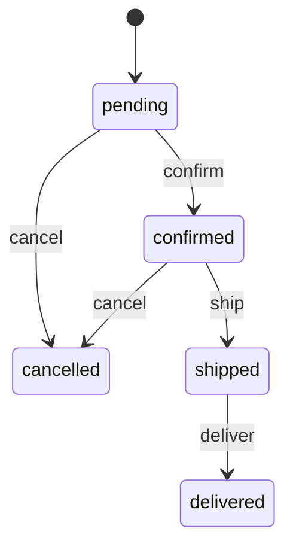

# State Machines

Finite State Machines (FSM) for workflow automation using the `smd` table.

> **⚠️ KNOWN ISSUE (2026-01-25):** State machine HTTP endpoints (`/track/start/`, `/track/event:`) currently return HTML instead of JSON due to a routing conflict with the admin UI. The infrastructure works correctly (tables auto-create, definitions load), but transitions must be applied via SQL workaround. See [Workarounds](#workarounds) section below.

## Overview

Daptin provides a state machine system that:
- ✅ Defines valid states for records
- ✅ Auto-creates `{tablename}_state` tables when `IsStateTrackingEnabled: true`
- ✅ Stores state machine definitions in `smd` table
- ⚠️ **API endpoints currently non-functional** (routing bug)
- ✅ Uses the [looplab/fsm](https://github.com/looplab/fsm) Go library

**Last Tested:** 2026-01-25 | **Test Report:** `test-results/02-state-machines.md`

## Architecture

State machines in Daptin work through:
1. **`smd` table** - Stores state machine definitions
2. **`{tablename}_state` table** - Auto-created to track state instances
3. **HTTP endpoints** - Start state machines and apply transitions

## The `smd` Table

State machine definitions are stored in the `smd` table:

| Column | Type | Description |
|--------|------|-------------|
| `name` | varchar(100) | Unique identifier for the state machine |
| `label` | varchar(100) | Human-readable name |
| `initial_state` | varchar(100) | Starting state for new instances |
| `events` | text (JSON) | Array of transition definitions |

### Events JSON Format

```json
[
  {
    "name": "approve",
    "label": "Approve",
    "color": "#28a745",
    "src": ["pending"],
    "dst": "approved"
  },
  {
    "name": "reject",
    "label": "Reject",
    "color": "#dc3545",
    "src": ["pending"],
    "dst": "rejected"
  },
  {
    "name": "reopen",
    "label": "Reopen",
    "color": "#ffc107",
    "src": ["rejected", "approved"],
    "dst": "pending"
  }
]
```

| Field | Description |
|-------|-------------|
| `name` | Event identifier used in API calls |
| `label` | Display name for UI |
| `color` | Hex color for UI rendering |
| `src` | Array of valid source states |
| `dst` | Destination state after transition |

## Defining State Machines

### Via YAML Schema

```yaml
StateMachineDescriptions:
  - Name: order_workflow
    Label: Order Workflow
    InitialState: pending
    Events:
      - Name: confirm
        Label: Confirm Order
        Src:
          - pending
        Dst: confirmed

      - Name: ship
        Label: Ship Order
        Src:
          - confirmed
        Dst: shipped

      - Name: deliver
        Label: Mark Delivered
        Src:
          - shipped
        Dst: delivered

      - Name: cancel
        Label: Cancel Order
        Src:
          - pending
          - confirmed
        Dst: cancelled
```

### Via API

```bash
# Create state machine definition
curl -X POST http://localhost:6336/api/smd \
  -H "Authorization: Bearer $TOKEN" \
  -H "Content-Type: application/vnd.api+json" \
  -d '{
    "data": {
      "type": "smd",
      "attributes": {
        "name": "ticket_status",
        "label": "Ticket Status",
        "initial_state": "open",
        "events": "[{\"name\":\"assign\",\"label\":\"Assign\",\"src\":[\"open\"],\"dst\":\"assigned\"},{\"name\":\"resolve\",\"label\":\"Resolve\",\"src\":[\"assigned\"],\"dst\":\"resolved\"},{\"name\":\"close\",\"label\":\"Close\",\"src\":[\"resolved\"],\"dst\":\"closed\"}]"
      }
    }
  }'
```

## Enabling State Tracking

To track state for a table, enable state tracking in the table definition:

```yaml
Tables:
  - TableName: order
    IsStateTrackingEnabled: true
    Columns:
      - Name: customer_name
        DataType: varchar(200)
        ColumnType: label
      - Name: total
        DataType: decimal
        ColumnType: measurement
```

When `IsStateTrackingEnabled: true`, Daptin automatically creates:
- `{tablename}_state` table with:
  - `current_state` column
  - Foreign key `is_state_of_{tablename}` to the original table
  - Foreign key `{tablename}_smd` to the state machine definition
  - User tracking columns

## Working with State Machines

### Step 1: List Available State Machines

```bash
curl http://localhost:6336/api/smd \
  -H "Authorization: Bearer $TOKEN"
```

Response:
```json
{
  "data": [
    {
      "type": "smd",
      "id": "abc123",
      "attributes": {
        "name": "order_workflow",
        "label": "Order Workflow",
        "initial_state": "pending",
        "events": "[{\"name\":\"confirm\",...}]"
      }
    }
  ]
}
```

### Step 2: Start a State Machine Instance

Create a state tracking instance for a record:

```bash
# POST /api/{typename}/{recordId}/state/start
curl -X POST "http://localhost:6336/api/order/$ORDER_ID/state/start" \
  -H "Authorization: Bearer $TOKEN" \
  -H "Content-Type: application/json" \
  -d '{
    "stateMachineId": "SMD_REFERENCE_ID"
  }'
```

This creates a record in `order_state` with:
- `current_state` = `pending` (from initial_state)
- `is_state_of_order` = reference to the order
- `order_smd` = reference to the state machine

### Step 3: Apply a Transition

```bash
# POST /api/{typename}_state/{stateId}/{eventName}
curl -X POST "http://localhost:6336/api/order_state/$STATE_ID/confirm" \
  -H "Authorization: Bearer $TOKEN"
```

Response on success:
```json
{
  "data": {
    "type": "order_state",
    "id": "state123",
    "attributes": {
      "current_state": "confirmed"
    }
  }
}
```

### Step 4: Query Current State

```bash
curl "http://localhost:6336/api/order_state/$STATE_ID" \
  -H "Authorization: Bearer $TOKEN"
```

## Transition Validation

Transitions are validated by the FSM engine:

1. Load current state from `{typename}_state.current_state`
2. Check if event is valid from current state using `Can(eventName)`
3. If valid, transition to destination state
4. If invalid, return error

### Invalid Transition Error

```json
{
  "errors": [
    {
      "status": "400",
      "title": "Invalid Transition",
      "detail": "event 'ship' inappropriate in current state 'pending'"
    }
  ]
}
```

## Complete Example: Order Workflow

### 1. Create the State Machine

```bash
curl -X POST http://localhost:6336/api/smd \
  -H "Authorization: Bearer $TOKEN" \
  -H "Content-Type: application/vnd.api+json" \
  -d '{
    "data": {
      "type": "smd",
      "attributes": {
        "name": "order_workflow",
        "label": "Order Workflow",
        "initial_state": "pending",
        "events": "[{\"name\":\"confirm\",\"label\":\"Confirm\",\"src\":[\"pending\"],\"dst\":\"confirmed\"},{\"name\":\"ship\",\"label\":\"Ship\",\"src\":[\"confirmed\"],\"dst\":\"shipped\"},{\"name\":\"deliver\",\"label\":\"Deliver\",\"src\":[\"shipped\"],\"dst\":\"delivered\"},{\"name\":\"cancel\",\"label\":\"Cancel\",\"src\":[\"pending\",\"confirmed\"],\"dst\":\"cancelled\"}]"
      }
    }
  }'
```

### 2. Create an Order

```bash
curl -X POST http://localhost:6336/api/order \
  -H "Authorization: Bearer $TOKEN" \
  -H "Content-Type: application/vnd.api+json" \
  -d '{
    "data": {
      "type": "order",
      "attributes": {
        "customer_name": "John Doe",
        "total": 99.99
      }
    }
  }'
# Save the returned reference_id as ORDER_ID
```

### 3. Start State Tracking

```bash
curl -X POST "http://localhost:6336/api/order/$ORDER_ID/state/start" \
  -H "Authorization: Bearer $TOKEN" \
  -d '{"stateMachineId": "SMD_REFERENCE_ID"}'
# Save the returned state id as STATE_ID
```

### 4. Transition Through States

```bash
# Confirm the order
curl -X POST "http://localhost:6336/api/order_state/$STATE_ID/confirm" \
  -H "Authorization: Bearer $TOKEN"

# Ship the order
curl -X POST "http://localhost:6336/api/order_state/$STATE_ID/ship" \
  -H "Authorization: Bearer $TOKEN"

# Mark delivered
curl -X POST "http://localhost:6336/api/order_state/$STATE_ID/deliver" \
  -H "Authorization: Bearer $TOKEN"
```

### 5. Query All Orders with State

```bash
curl "http://localhost:6336/api/order_state?include=is_state_of_order" \
  -H "Authorization: Bearer $TOKEN"
```

## Visualizing State Machines

State machines can be visualized using the events JSON:

### Mermaid Diagram



### Parse Events for Visualization

```javascript
const smd = await fetch('/api/smd/ORDER_WORKFLOW_ID').then(r => r.json());
const events = JSON.parse(smd.data.attributes.events);

// Generate Mermaid syntax
let mermaid = 'stateDiagram-v2\n';
mermaid += `    [*] --> ${smd.data.attributes.initial_state}\n`;
events.forEach(e => {
  e.src.forEach(src => {
    mermaid += `    ${src} --> ${e.dst}: ${e.name}\n`;
  });
});
```

## Audit Trail

State transitions are tracked automatically:
- Each transition increments the `version` field in `{typename}_state`
- State audit records are created for each transition
- Events are published to PubSub topics

## Permissions

State machine transitions require Execute permission on the `smd` table. Only users with appropriate permissions can:
- Create state machine definitions
- Start state machine instances
- Apply state transitions

## Limitations

The current implementation:
- **No guard conditions** - Transitions validate only source state membership
- **No entry/exit actions** - Actions must be triggered separately
- **No parallel states** - One state per instance only
- **No hierarchical states** - Flat state structure only

For complex workflows requiring guards or actions, combine state machines with [Custom Actions](Custom-Actions.md) that check state before executing.

## Workarounds

### SQL-Based State Transitions (Tested ✅)

Since API endpoints currently have issues (see [#170](https://github.com/daptin/daptin/issues/170), [#171](https://github.com/daptin/daptin/issues/171)), you can manage state transitions via SQL:

**Stop server (database locked while running):**
```bash
pkill -9 -f daptin && sleep 2
```

**Apply transition:**
```bash
# Check current state
sqlite3 daptin.db "SELECT id, current_state, version FROM {typename}_state WHERE id = 1;"

# Apply transition (update state + increment version)
sqlite3 daptin.db "UPDATE {typename}_state SET current_state = 'new_state', version = version + 1, updated_at = current_timestamp WHERE id = 1 AND current_state = 'current_state';"

# Verify
sqlite3 daptin.db "SELECT id, current_state, version FROM {typename}_state;"
```

**Restart server:**
```bash
nohup ./daptin > /tmp/daptin.log 2>&1 &
```

**Limitations of SQL approach:**
- No automatic validation of transition legality (you must check events JSON manually)
- No automatic event logging/PubSub
- Must manually increment version field
- Server must be stopped (database locked)

### Validate Transitions Before Applying

Check which transitions are valid from current state:

```bash
# Get state machine events
sqlite3 daptin.db "SELECT events FROM smd WHERE name = 'ticket_workflow';" | jq -r '.[] | "\(.Name): \(.Src[]) -> \(.Dst)"'

# Example output:
# assign: open -> assigned
# resolve: assigned -> resolved
# close: resolved -> closed
```

Only apply transitions where current state matches a source state in the event definition.

**Tested:** 2026-01-25 | **Test Suite:** test-results/02-state-machines.md

## Related

- [Custom Actions](Custom-Actions.md) - Define actions triggered by state
- [Event System](Event-System.md) - Subscribe to state change events
- [Permissions](Permissions.md) - Control who can transition states
- **GitHub Issues:** [#170 (Routing bug)](https://github.com/daptin/daptin/issues/170), [#171 (Handler bugs)](https://github.com/daptin/daptin/issues/171)
